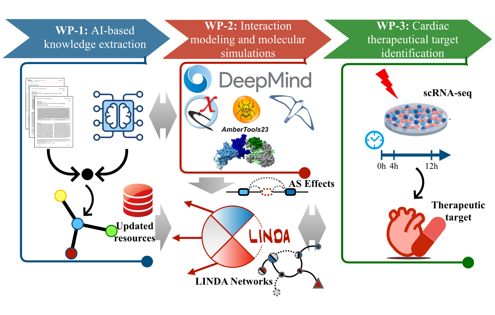

# ALL-LINDA

Despite the unique ability to jointly model protein interaction networks on multi-cellular 
systems while at the same time to also account for the addition/removal of protein domains, 
the LINDA framework currently has some limitations. First, LINDA relies on established 
PPI/DDI and TF-Gene relation resources, which are typically incomplete and are not 
continuously updated. Additionally, these resources are heavily biased toward certain 
overrepresented medical conditions, particularly cancer, which makes their application 
in other medical contexts challenging. Moreover, the LINDA methodology has limitations 
in capturing the full dynamic effects of AS on protein interactions. Specifically LINDA, 
can only model one type of AS effects, namely exon-skipping, while other types remain 
unaccounted for. In addition to that, we can only model the effects of complete exon 
skipping or inclusion, resulting in the full addition or removal of protein domains, 
while partial splicing effects remain unconsidered. Finally, to better pinpoint the 
most likely signalling mechanisms from sequencing data, the LINDA framework would 
benefit from improved identifiability, as the current approach often produces for 
the same context or condition several equally plausible explanations of signalling 
mechanisms and how they are affected by splicing. 

To address these challenges, we propose enhancing the current LINDA framework with 
Artificial Intelligence (AI), incorporating Large Language Models (LLMs) and AlphaFold3 (AF3) 
into an integrated framework called ALL-LINDA (**Figure 8**). More specifically, LLMs will be employed 
to mine the vast scientific literature, ensuring continuously updated knowledge of molecular 
interactions across pre-selected biological domains. Additionally, AlphaFold will be 
used to computationally validate protein interactions based on their folding structures 
and thermodynamic properties, thus ensuring a more accurate representation of 
molecular interactions. Molecular Dynamics (MD) simulations will also be performed 
following AlphaFold modelling to identify and account for thermodynamically more plausible 
interactions, thus alleviating some of the mentioned identifiability issues.

_Figure 8: ALL-LINDA Workflow depicted thrrough Work-Packages_

**This is work in progress and documentation on this project will be provided shortly.**