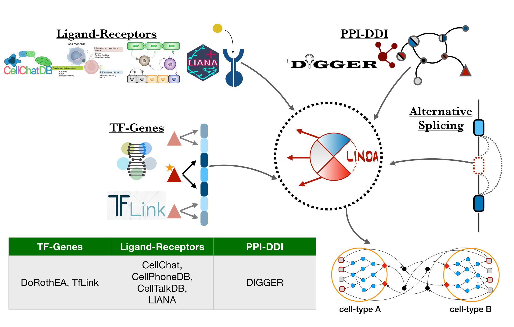

# Welcome to LINDA+

This is the documentation page of the LINDA+ software.

## Workflow
LINDA+ is a method used to identify intra- and inter-cellular interaction networks at a domain resolution, allowing to further study the effects of Alternative Splicing (AS) on signalling. It is a tool that integrates large-scale knowledge of directed joint interactions (protein-protein and Domain-Domain intra-cellular interactions) as well as structurally resolved ligand-receptor pairs from various resources with estimated transcription factor enzymatic activities based on sc-RNAseq reads (see **Figure 1.**).

<div style="text-align: center;">
    
    <p><em>Figure 1: LINDA+ Pipeline</em></p>
</div>

At the core of LINDA+ stands an optimization problem, formulated as an Integer Linear Programming (ILP), which allows for joint mechanistic analysis of inter- and intra-cellular protein interaction networks based on scRNAseq data.


## Dependencies

### Resources
LINDA+ relies the following resources for performing it's analysis:

* <p style="font-weight: bold;">Resources of protein interactions at a domain resolution level:</p> By default, LINDA+ uses [DIGGER](https://academic.oup.com/nar/article/49/D1/D309/5911747) as a resource of joint Protein-Protein (PPI) and Domain-Domain (DDI) interactions in human. This allows LINDA+ to mechanistically characterize effects that post-transcriptional processes, such as alternative splicing, might have on protein interaction networks.<br><br>
* <p style="font-weight: bold;">Resources of ligand-receptor pairs:</p> Several ligand-receptor interaction resources have been integrated in LINDA+, including: [CellChat](https://www.nature.com/articles/s41467-021-21246-9), [CellPhoneDB](https://www.cellphonedb.org/), [CellTalkDB](https://github.com/ZJUFanLab/CellTalkDB) and [LIANA](https://liana-py.readthedocs.io/en/latest/). For LINDA+, we have additionally annotated extracellular domains of the receptors, through which the ligands would be able to interact.<br><br>
* <p style="font-weight: bold;">Resources of transcription factors (TF) to gene relations:</p> LINDA+ additionally relies on known tf-to-gene relations in order to: **i)** Determine significantly regulated TF's based on gene-expression values for each cell-type; and **ii)** Identifying what kinds of ligand genes do these TF's regulate and which can then be secreted into the extra-cellular space. Two types of human tf-to-gene resources have been integrated in LINDA+: [DoRothEA](https://saezlab.github.io/dorothea/) and [TfLink](https://tflink.net/).

All of the above resources have been integrated in the LINDA+ R-package and details about how combinations of each type of resource can be used for a real-case application of LINDA+ can be found in the Tutorials (hyperlinked once tutorials have been added).

Users can of course use their own resources of molecular interactions for as long as they are provided in a format recognizable by LINDA+ (see details here (hyperlink to be added later)).

Additionally we provide prior knowledge of interactions tailored specifically towards contextualizing molecular interaction networks in a cardiobiology context (details here (to be added when ready)). For this purpose we have utilized prompt-based data mining of Large Language Models (LLM's), to enhance our biomedical knowledge resources based on a collection 1015 molecular cardiology related manuscripts (see details here (hyperlink to be added later)).

### Solver
LINDA+ requires the interactive version of IBM Cplex as an ILP problem optimiser. The IBM ILOG Cplex is freely available through [Academic Initiative](https://www.ibm.com/products/ilog-cplex-optimization-studio?S_PKG=CoG&cm_mmc=Search_Google-_-Data+Science_Data+Science-_-WW_IDA-_-+IBM++CPLEX_Broad_CoG&cm_mmca1=000000RE&cm_mmca2=10000668&cm_mmca7=9041989&cm_mmca8=kwd-412296208719&cm_mmca9=_k_Cj0KCQiAr93gBRDSARIsADvHiOpDUEHgUuzu8fJvf3vmO5rI0axgtaleqdmwk6JRPIDeNcIjgIHMhZIaAiwWEALw_wcB_k_&cm_mmca10=267798126431&cm_mmca11=b&mkwid=_k_Cj0KCQiAr93gBRDSARIsADvHiOpDUEHgUuzu8fJvf3vmO5rI0axgtaleqdmwk6JRPIDeNcIjgIHMhZIaAiwWEALw_wcB_k_%7C470%7C135655&cvosrc=ppc.google.%2Bibm%20%2Bcplex&cvo_campaign=000000RE&cvo_crid=267798126431&Matchtype=b&gclid=Cj0KCQiAr93gBRDSARIsADvHiOpDUEHgUuzu8fJvf3vmO5rI0axgtaleqdmwk6JRPIDeNcIjgIHMhZIaAiwWEALw_wcB).

Details about how to obtain the free full license under the Academic Initiative have been provided [here](https://community.ibm.com/community/user/blogs/xavier-nodet1/2020/07/09/cplex-free-for-students).

Once the CPLEX solver has been acquired by the user, they must save the executable files in any desired location in the machine they are using and then they can run. Then, thy should make the acquired cplex solver executable, but running the following (in MAC/Unix systems): `chmod +x cplex`. Finally, you can perform the LINDA+ analyses after specifying the path to the executable file (through the solverPath parameter, see examples below).

## Installation
Once the required solvers have been obtained and the mentioned R-package depedencies have been installed, then the users can proceed with the installation of LINDA.

Currently users can install LINDA+ either through GitHub or directly from the source after downloading the source (tar file) and typing one of the following in the R command line:

* *directly from GitHub:*
```r
devtools::install_github("dieterich-lab/LINDAPlus", build_vignettes = FALSE)
```

* *or from source:*
```r
devtools::install_local(path = "path_to_extracted_LINDAPlus_directory", build_manual = TRUE, build_vignettes = FALSE, force = TRUE)
```

**NOTE:** If you wish for the the Vignettes to be built and for the test example to run successfully, please put the _cplex_ executable file under the `/Downloads/` directory and only then you can set ```build_vignettes = TRUE```. In the case when building the vignettes is not possible, you can access it [here](https://github.com/dieterich-lab/LINDAPlus/blob/master/vignettes/LINDAPlus.html).

Upon installation of the package, you can check on the package Vignettes:

```r
# check vignettes
vignette("LINDAPlus")

# check documentation of the main function
?runLINDAPlus
```
