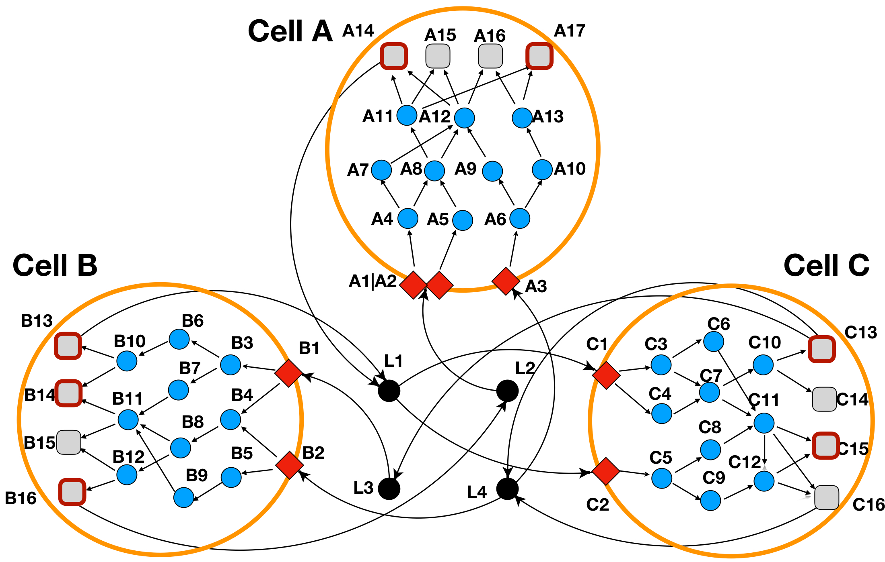
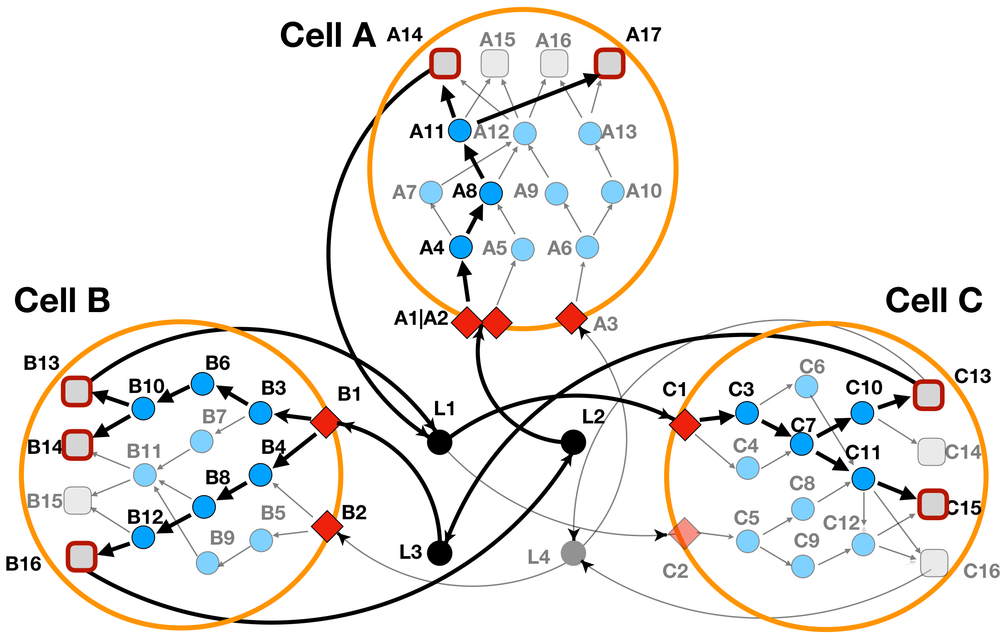
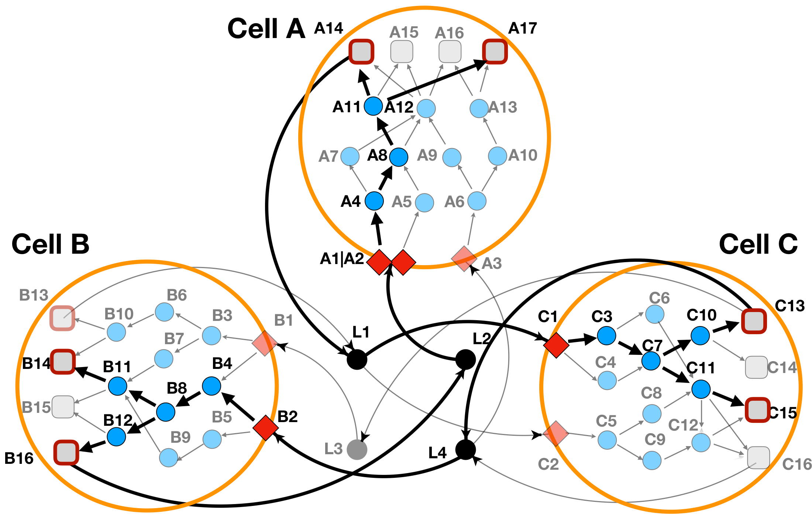
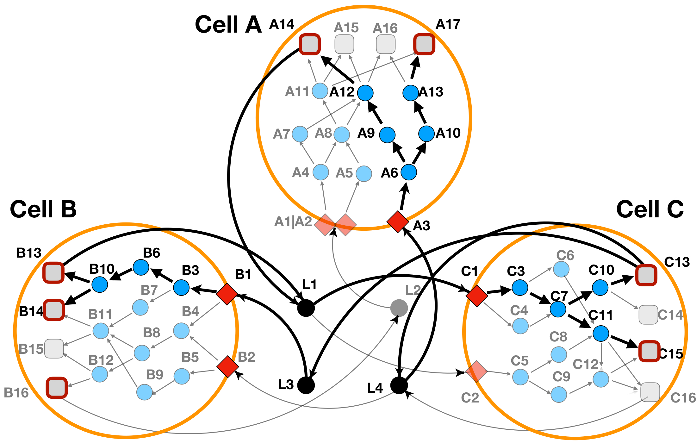

# Tutorials
Here are provided tutorials about how to use LINDA+ R-package in it's basic form as well as all of it's implemented features. We start by first describing the inputs that are to be given for a LINDA+ analysis, followed by tutorial examples of each feature on a small Toy example to then follow with a real-case application.

## Toy Example
Below are provided the steps of running a small Toy test study which we have depicted in **Figure 2**. In this Toy case-study we are depicting a system of 3 different cell-types (_CellA_, _CellB_ and _CellC_) where each node represents a protein (domains not depicted) while edges represent interactions between nodes. Red rhombus represent cell-receptors, blue circles represent intra-cellular proteins, gray squares represent TF’s, while in black circles we are depicting ligands in the extra-cellular space.

<div style="text-align: center;">
    
    <p><em>Figure 2: LINDA+ 3-Cell System Toy Example</em></p>
</div>

In **Figure 2** we have defined as the significantly regulated TF's those squares that have a thick red border (nodes A14 and A17 for _CellA_; nodes B13, B14 and B16 for _CellB_; nodes C13 and C15 for _CellC_).

Additionally, we might notice that we have a receptor named 'A1|A2' in _CellA_. Such an annotation should be used for the cases when a receptor consist of a complex of two or more proteins (in this case A and B). **NOTE:** LINDA+ is able to handle interactions of ligands with protein complex receptors and  receptors that consist of multi-subunit protein complexes (i.e. 2 or more protein units), should be depicted as separated through `|`.

The set of DDI/PPI interactions for this toy example, can be loaded by running the following:

```r
library(LINDAPlus)

load(file = system.file("extdata", "toy.background.networks.list.RData", package = "LINDAPlus"))
# print(background.networks.list)
```

### LINDA+ basic mode analysis
For running LINDA+ in it's basic mode, besides the `background.networks.list` object, we would also need to provide a list of TF enrichment scores for each cell-type as well as define which one of them are to be considered as significantly regulated based on their absolute enrichment score values. More information about how we can obtain TF enrichment score values for each cell-type based on sc/sn-RNAseq data has been provided here (link to real case example when ready).

The estimated TF activity scores should be provided as a named list (for each cell-type) and which contains data-frames indicating the enrichment scores for each TF at each cell-type like in the object that we load below:

```r
load(file = system.file("extdata", "toy.tf.scores.RData", package = "LINDAPlus"))
# print(tf.scores)
```

Additionally users can provide a named (also by cell-type) numerical vector to indicate the number of TF’s to consider as significantly regulated based on their absolute enrichment values. In case that this parameter has not been defined, then by default all the TF’s provided in the data-frames list will be considered as significantly regulated.

```r
load(file = system.file("extdata", "toy.top.tf.RData", package = "LINDAPlus"))
# print(top.tf)
```

This is all that would be needed to run LINDA+ in it's simplest form and we can anchieve this as in the following:

```r
res <- runLINDAPlus(background.networks.list = background.networks.list,
                    tf.scores = tf.scores,
                    solverPath = "/usr/bin/cplex", #or just change the path to where the cplex executable is located
                    top.tf = top.tf)

# print(res$combined_solutions)
# print(res$node_attributes)
```

The optimization results (as read from the ```res$combined_solutions``` output table), has been depicted in the **Figure 3** below.

<div style="text-align: center;">
    
    <p><em>Figure 3: LINDA+ 3-Cell System Toy Example - Basic Run. In bold are highlighted the interactions and nodes that have been inferred as functional/regulated in our network analysis.</em></p>
</div>

### LINDA+ with ligand scores analysis
Users can provide information about the abundance of ligands in the extra-cellular space as made evident by Secretomics data through a data-frame object. More abundant ligands/extra-cellular molecules are more likely to initiate conformational changes in receptors. The data-frame provided should contain two columns: ‘ligands’ (providing the ligand ID’s) and ‘score’ (providing the score associated to each ligand, i.e. abundance). The higher the score of the ligand, the more likely it will be for a ligand to appear in the solution. In this case, we penalize the inclusion of ligand L3 in the solution (lower score value given).

```r
## Loading the ligand scores
load(file = system.file("extdata", "toy.ligand.scores.RData", package = "LINDAPlus"))
# print(ligand.scores)

## Running LINDA+
res <- runLINDAPlus(background.networks.list = background.networks.list,
                    tf.scores = tf.scores,
                    solverPath = "/usr/bin/cplex", #or just change the path to where the cplex executable is located
                    top.tf = top.tf,
                    ligand.scores = ligand.scores)

# print(res$combined_solutions)
# print(res$node_attributes)
```
The optimization result for this case has been depicted in **Figure 4** below.

<div style="text-align: center;">
    
    <p><em>Figure 4: LINDA+ 3-Cell System Toy Example - Analysis with ligand scores. In bold are highlighted the interactions and nodes that have been inferred as functional/regulated in our network analysis. Ligand 'L3', does not participate anymore in the interaction.</em></p>
</div>

### LINDA+ with ligand-receptor scores analysis
In the case when Secretomics data is not available, users may still have evidence of functional ligand-receptor interactions. This evidence can come from previous cell-communication analysis based on sc-RNAseq data. In such cases, users can integrate the enrichment scores for ligand-receptor pairs into LINDA+. Doing so helps guide the network inference towards the desired ligand-receptor interactions. In this case users can provide a named list (for each cell-type) of data-frames consisting of ligand-receptor enrichment scores normalized between the values of 0 and 1.

```r
## Loading the ligand-receptor scores
load(file = system.file("extdata", "toy.lr.scores.RData", package = "LINDAPlus"))
# print(lr.scores)

## Running LINDA+
res <- runLINDAPlus(background.networks.list = background.networks.list,
                    tf.scores = tf.scores,
                    solverPath = "/usr/bin/cplex", #or just change the path to where the cplex executable is located
                    top.tf = top.tf,
                    lr.scores = lr.scores)

# print(res$combined_solutions)
# print(res$node_attributes)
```

In this case, we have assigned a score 0 for the 'L2=A1|A2' interaction. The optimization result for this case has been depicted in **Figure 5** below.

<div style="text-align: center;">
    
    <p><em>Figure 5: LINDA+ 3-Cell System Toy Example - Analysis with ligand-receptor scores. In bold are highlighted the interactions and nodes that have been inferred as functional/regulated in our network analysis. Interaction 'L2=A1|A2', does not participate anymore in the solution and the network has been re-wired towards alternative solutions.</em></p>
</div>

### LINDA+ with cell-cell communication scores analysis
Users can additionally provide scores (between 0 and 1) representing probability values about how likely would be for two cell-types to directly communicate with each-other (i.e. as made evident through spatial transcriptomics). The higher the score given, the more is likely for a cell-type pair to be directly communicating with each other, and when such score is set to 0, then special constraints will make it so these two cell-types would not be able to directly communicate with each-other. Such scores can be used in our modelling approach where we for example know that specific cell-types are in proximity or distant to each other, thus making the chances of direct communication between them higher or lower. Let’s see how such scores can be provided and integrated into the LINDA+ analysis and what effects it has:

```r
## Loading the cell-cell communication scores
load(file = system.file("extdata", "toy.ccc.scores.RData", package = "LINDAPlus"))
# print(ccc.scores)

## Running LINDA+
res <- runLINDAPlus(background.networks.list = background.networks.list,
                    tf.scores = tf.scores,
                    solverPath = "/usr/bin/cplex", #or just change the path to where the cplex executable is located
                    top.tf = top.tf,
                    ccc.scores = ccc.scores)

# print(res$combined_solutions)
# print(res$node_attributes)
```

In the `ccc.scores` object we have assigned a score 0 for 'CellA=CellC'. This can be interpreted that we ask for our model to not allow _CellA_ to talk to _CellB_. The optimization result for this case has been depicted in **Figure 6** below.

<div style="text-align: center;">
    
    <p><em>Figure 6: LINDA+ 3-Cell System Toy Example - Analysis with cell-cell communication probability scores. In bold are highlighted the interactions and nodes that have been inferred as functional/regulated in our network analysis. Interaction 'A14=L1', does not participate anymore in the solution, meaning that _CellA_ is not communicating to _CellC_ via the release of ligand 'L1'.</em></p>
</div>

### LINDA+ with alternative splicing effects
Given that LINDA+ simultaneously infers not only protein-protein interactions but also domain interactions, it enables us to examine how RNA modification mechanisms, like alternative splicing, might influence the presence or absence of domains within the structure of interacting proteins. This, in turn, allows us to assess the effects of such modifications on the interactions between proteins.

This is achieved by giving to the network inference function an `as.input` data-frame object which lists domain ID’s of certain proteins for any cell-type and how they have been affected based on, for example, evidence from differential splicing analyses. These effects can include _exclusion_ (when we know that a domain of a protein has been skipped) or _inclusion_ (when we try to understand how the inclusion of a domain in the network solution might affect the protein interactions).

In the toy example below it can be demonstrated how the `as.input` object should be defined.

```r
## Loading the alternative splicing effects objects
load(file = system.file("extdata", "toy.as.input.RData", package = "LINDAPlus"))
# print(as.input)

## Running LINDA+
res <- runLINDAPlus(background.networks.list = background.networks.list,
                    tf.scores = tf.scores,
                    as.input = as.input,
                    solverPath = "/usr/bin/cplex", #or just change the path to where the cplex executable is located
                    top.tf = top.tf)

# print(res$combined_solutions)
# print(res$node_attributes)
```

In **Figure 7** we can see how the addition of information about included or excluded protein domains affects the re-wiring of the protein interactions.

<div style="text-align: center;">
    
    <p><em>Figure 7: LINDA+ 3-Cell System Toy Example - Analysis with alternative-splicing effects. In bold are highlighted the interactions and nodes that have been inferred as functional/regulated in our network analysis. Protein 'A8', does not participate anymore in the solution, since it's iteracting domains have been considered as skipped. Signalling has been rewired towards protein 'A7' and 'A9' instead.</em></p>
</div>

### LINDA+ with perturbation effects
Such feature which allows the users to introduce into the multicellular system effects from i.e. distant ligands or ligands which they themselves experimentally introduce into the system as a perturbation effect. In the case where the user wisshes to add perturbation effects from a specific ligand which does not come from any of the cell-types, LINDA+ automatically introduces into the system an auxilliary _PseudoCell_ which consists of a single 'PSEUDOLIGAND', 'PSEUDORECEPTOR', 'PSEUDOPROTEIN' and 'PSEUDOTF' where the latter is then connected to the ligands that we are introducing in the system. In this case LINDA+ will then infer the interaction mechanisms happening within such PseudoCell and which lead to the secretion of the ligands which the users are are introducing remotely.

Let’s see how this example works by first loading the background network as well as the TF score objects with the effects from the _PseudoCell_:

```r
## Loading the background knowledge with the PseudCell cell-type
load(file = system.file("extdata", "toy.background.networks.list.with.perturbations.RData", package = "LINDAPlus"))
# print(background.networks.list$background.networks$PseudoCell)

## Loading the tf scores where PSEUDOTF of PseudoCell is considered as regulated
load(file = system.file("extdata", "toy.tf.scores.with.perturbations.RData", package = "LINDAPlus"))
load(file = system.file("extdata", "toy.top.tf.with.perturbations.RData", package = "LINDAPlus"))
# print(tf.scores$PseudoCell)
# print(top.tf)

## Running LINDA+
res <- runLINDAPlus(background.networks.list = background.networks.list,
                    tf.scores = tf.scores,
                    solverPath = "/usr/bin/cplex", #or just change the path to where the cplex executable is located
                    top.tf = top.tf)

# print(res$combined_solutions)
# print(res$node_attributes)
```

In **Figure 8** we can see how the addition of an external perturbation ligand affects our toy multi-cellular system.

<div style="text-align: center;">
    
    <p><em>Figure 8: LINDA+ 3-Cell System Toy Example - Analysis with ligand perturbation effects. In bold are highlighted the interactions and nodes that have been inferred as functional/regulated in our network analysis. Ligand 'L5' perturbs _CellA_ and _CellB_, despite seemingly not being secreted by any of the three cell-types into consideration.</em></p>
</div>

## Real-case application
TODO when package available online.
