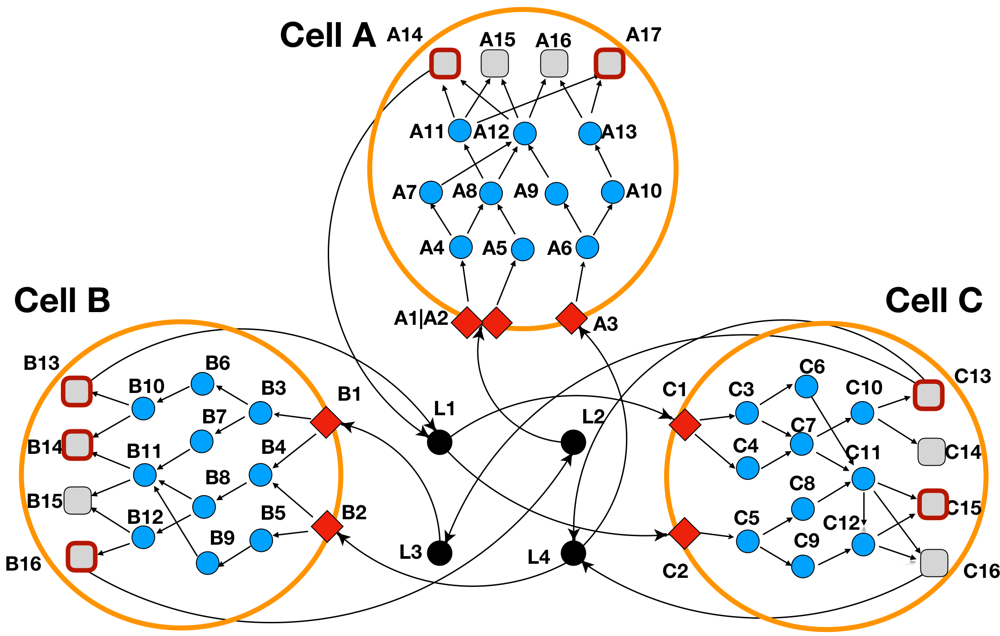
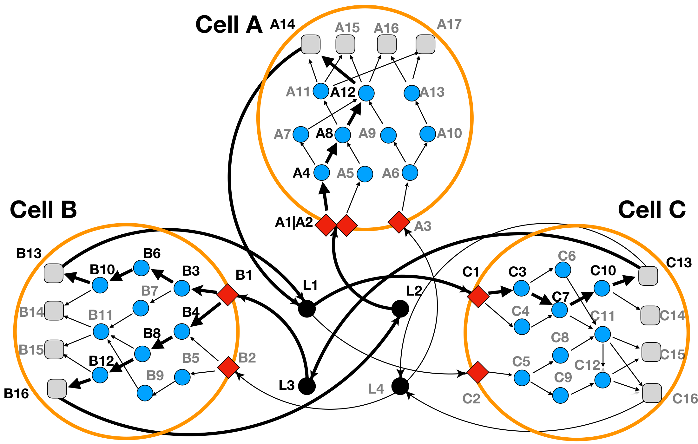
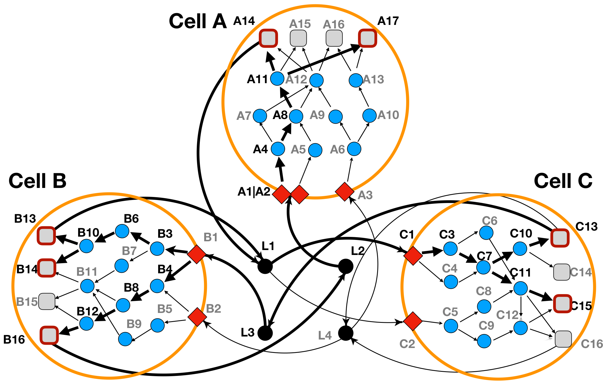
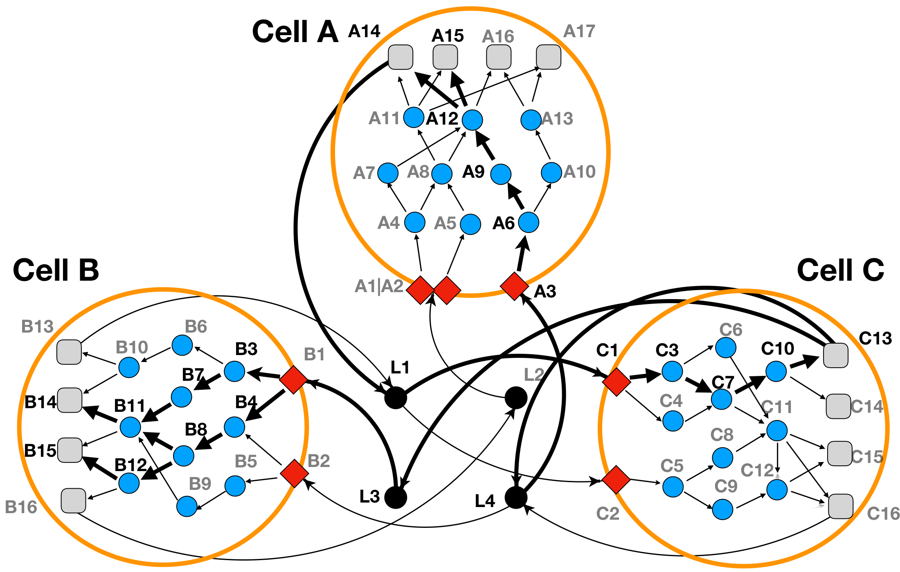
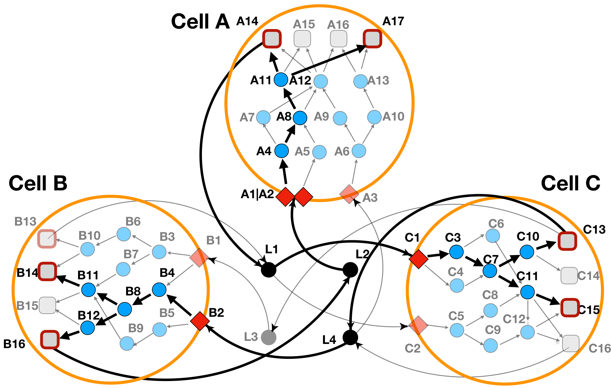
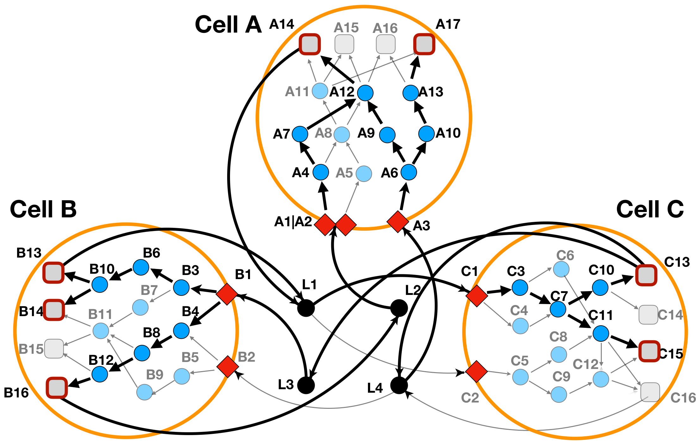
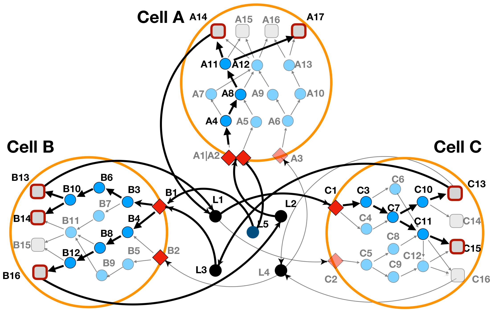

# Tutorials

Here are provided tutorials about how to use LINDA+ R-package in it's basic form as well as all of it's implemented features. We start by first describing the inputs that are to be given for a LINDA+ analysis, followed by tutorial examples of each feature on a small Toy example to then follow with a real-case application.

## Toy Example

Below are provided the steps of running a small Toy test study which we have depicted in **Figure 2**. In this Toy case-study we are depicting a system of 3 different cell-types (_CellA_, _CellB_ and _CellC_) where each node represents a protein (domains not depicted) while edges represent interactions between nodes. Red rhombus represent cell-receptors, blue circles represent intra-cellular proteins, gray squares represent TF’s, while in black circles we are depicting ligands in the extra-cellular space.



_Figure 2: LINDA+ 3-Cell System Toy Example_

In **Figure 2** we have defined as the significantly regulated TF's those squares that have a thick red border (nodes A14 and A17 for _CellA_; nodes B13, B14 and B16 for _CellB_; nodes C13 and C15 for _CellC_).

Additionally, we might notice that we have a receptor named 'A1|A2' in _CellA_. Such an annotation should be used for the cases when a receptor consist of a complex of two or more proteins (in this case A and B). **NOTE:** LINDA+ is able to handle interactions of ligands with protein complex receptors and receptors that consist of multi-subunit protein complexes (i.e. 2 or more protein units), should be depicted as separated through `|`.

The set of DDI/PPI interactions for this toy example, can be loaded by running the following:

```r
library(LINDAPlus)

load(file = system.file("extdata", "toy.background.networks.list.RData", package = "LINDAPlus"))
# print(background.networks.list)
```

### LINDA+ basic mode analysis

When sc/snRNA-seq data is available, for running LINDA+ in it's basic mode, besides the `background.networks.list` object, it would also need to either provide a table of ligand-receptor interactions between a transmitter and receiver cell (as made evident by cell-cell communcation analyses) or a list of TF enrichment scores for each cell-type as (as made evident by TF enrichment analyses). For the latter case, we would also need to define which TF's are to be considered as significantly regulated based on their absolute enrichment score values. More information about how we can obtain such inputs from real-case sc/sn-RNAseq data has been provided here (link to real case example when ready).

Additionally users can rely on scProteomics data to infer network solution, either alone or in combination with scRNA-seq.

#### LINDA+ basic model with CCC
For the first case when we provide cell-communication analysis results as inputs (through the `ccc.input` object), they should be provided as a data table which contains information about the interacting ligand-receptor pairs as well as transmitter and receiver cells as shown in the object which is loaded in the following way:.

```r
load(file = system.file("extdata", "toy.ccc.input.RData", package = "LINDAPlus"))
# print(ccc.input)
```

This is all that would be needed to run LINDA+ in it's simplest form by giving cell-communication data as an input and we can anchieve this as in the following:

```r
res <- runLINDAPlus(background.networks.list = background.networks.list,
                    ccc.input = ccc.input,
                    solverPath = "/usr/bin/cplex") #or just change the path to where the cplex executable is located
```

The optimization results (as read from the `res$combined_solutions` output table), has been depicted in the **Figure 3a** below.



_Figure 3a: LINDA+ 3-Cell System Toy Example - Basic Run with cell-cell communication scores as input. In bold are highlighted the interactions and nodes that have been inferred as functional/regulated in our network analysis._

#### LINDA+ basic mode with TF activities
If only TF activities are preferred, the estimated TF activity scores should be provided as a named list (for each cell-type) and which contains data-frames indicating the enrichment scores for each TF at each cell-type like in the object that we load below:

```r
load(file = system.file("extdata", "toy.tf.input.RData", package = "LINDAPlus"))
# print(tf.input)
```

Additionally users can provide a named (also by cell-type) numerical vector to indicate the number of TF’s to consider as significantly regulated based on their absolute enrichment values. In case that this parameter has not been defined, then by default all the TF’s provided in the data-frames list will be considered as significantly regulated.

```r
load(file = system.file("extdata", "toy.top.tf.RData", package = "LINDAPlus"))
# print(top.tf)
```

This is all that would be needed to run LINDA+ in it's simplest form and we can anchieve this as in the following:

```r
res <- runLINDAPlus(background.networks.list = background.networks.list,
                    tf.input = tf.input,
                    solverPath = "/usr/bin/cplex", #or just change the path to where the cplex executable is located
                    top.tf = top.tf)

# print(res$combined_solutions)
# print(res$node_attributes)
```

The optimization results (as read from the `res$combined_solutions` output table), has been depicted in the **Figure 3b** below.



_Figure 3b: LINDA+ 3-Cell System Toy Example - Basic Run with TF activity scores provided as inputs. In bold are highlighted the interactions and nodes that have been inferred as functional/regulated in our network analysis._

#### LINDA+ basic mode with scProteomics
Besides scRNA-seq, users can also rely on scProteomics data to infer network solutions. In this case, thy would need to provide a `prot.input` data-frame indicating proteins which would be preferred to be included in the solution for any given cell-type.

The `prot.input` object should have a structure like following:

```r
load(file = system.file("extdata", "toy.prot.input.RData", package = "LINDAPlus"))
# print(prot.input)
```

The analysis can then run as follows:

```r
res <- runLINDAPlus(background.networks.list = background.networks.list,
                    prot.input = prot.input,
                    solverPath = "/usr/bin/cplex", #or just change the path to where the cplex executable is located
                    )

# print(res$combined_solutions)
# print(res$node_attributes)
```



_Figure 3c: LINDA+ 3-Cell System Toy Example - Basic Run with protein activity scores provided as inputs. In bold are highlighted the interactions and nodes that have been inferred as functional/regulated in our network analysis._


### LINDA+ Multi-Modal
Users can optionally also chose to provide multiple types of inputs (`ccc.input`, `tf.input`, `prot.input`) at the same time and thus giving information about events in both the intra-cellular and extra-cellular space for inferring networks of protein interactions.

The example below depicts how we can use both `ccc.input` and `tf.input` which we can obtain from scRNA-seq analysis:

```r
res <- runLINDAPlus(background.networks.list = background.networks.list, 
                    ccc.input = ccc.input, 
                    tf.input = tf.input, 
                    top.tf = top.tf,
                    solverPath = "/usr/bin/cplex", #or just change the path to where the cplex executable is located
                    )

# print(res$combined_solutions)
# print(res$node_attributes)
```


_Figure 4: LINDA+ 3-Cell System Toy Example - Integrated Run with CCC and TF activities provided as inputs. In bold are highlighted the interactions and nodes that have been inferred as functional/regulated in our network analysis._


### LINDA+ with ligand scores analysis

Users can provide information about the abundance of ligands in the extra-cellular space as made evident by Secretomics data through a data-frame object. More abundant ligands/extra-cellular molecules are more likely to initiate conformational changes in receptors. The data-frame provided should contain two columns: ‘ligands’ (providing the ligand ID’s) and ‘score’ (providing the score associated to each ligand, i.e. abundance). The higher the score of the ligand, the more likely it will be for a ligand to appear in the solution. In this case, we penalize the inclusion of ligand L3 in the solution (lower score value given) and we provide the `ccc.input` as the other mandatory input in the analysis.
Of course the secretomics information should also be complemented with at least one of the mandatory inputs (`ccc.input`, `tf.input`, `prot.input`). Below we show a Toy example for the case when `ccc.input` is provided.

```r
## Loading the ligand scores
load(file = system.file("extdata", "toy.ligand.scores.RData", package = "LINDAPlus"))
# print(ligand.scores)

## Running LINDA+
res <- runLINDAPlus(background.networks.list = background.networks.list,
                    ccc.input = ccc.input,
                    solverPath = "/usr/bin/cplex", #or just change the path to where the cplex executable is located
                    ligand.scores = ligand.scores,
                    lambda1 = 5, lambda2 = 1, lambda4 = 20)

# print(res$combined_solutions)
# print(res$node_attributes)
```

The optimization result for this case has been depicted in **Figure 5** below.



_Figure 5: LINDA+ 3-Cell System Toy Example - Analysis with ligand scores. In bold are highlighted the interactions and nodes that have been inferred as functional/regulated in our network analysis. Ligand 'L3', does not participate anymore in the interaction._

### LINDA+ with alternative splicing effects

Given that LINDA+ simultaneously infers not only protein-protein interactions but also domain interactions, it enables us to examine how RNA modification mechanisms, like alternative splicing, might influence the presence or absence of domains within the structure of interacting proteins. This, in turn, allows us to assess the effects of such modifications on the interactions between proteins.

This is achieved by giving to the network inference function an `as.input` data-frame object which lists domain ID’s of certain proteins for any cell-type and how they have been affected based on, for example, evidence from differential splicing analyses. These effects can include _exclusion_ (when we know that a domain of a protein has been skipped) or _inclusion_ (when we try to understand how the inclusion of a domain in the network solution might affect the protein interactions).

In the toy example below it can be demonstrated how the `as.input` object should be defined.

```r
## Loading the alternative splicing effects objects
load(file = system.file("extdata", "toy.as.input.RData", package = "LINDAPlus"))
# print(as.input)

## Running LINDA+
res <- runLINDAPlus(background.networks.list = background.networks.list,
                    tf.input = tf.input,
                    as.input = as.input,
                    solverPath = "/usr/bin/cplex", #or just change the path to where the cplex executable is located
                    top.tf = top.tf)

# print(res$combined_solutions)
# print(res$node_attributes)
```

In **Figure 6** we can see how the addition of information about included or excluded protein domains affects the re-wiring of the protein interactions.



_Figure 6: LINDA+ 3-Cell System Toy Example - Analysis with alternative-splicing effects. In bold are highlighted the interactions and nodes that have been inferred as functional/regulated in our network analysis. Protein 'A8', does not participate anymore in the solution, since it's iteracting domains have been considered as skipped. Signalling has been rewired towards protein 'A7' and 'A9' instead._

### LINDA+ with perturbation effects

Such feature which allows the users to introduce into the multicellular system effects from i.e. distant ligands or ligands which they themselves experimentally introduce into the system as a perturbation effect. In the case where the user wisshes to add perturbation effects from a specific ligand which does not come from any of the cell-types, LINDA+ automatically introduces into the system an auxilliary _PseudoCell_ which consists of a single 'PSEUDOLIGAND', 'PSEUDORECEPTOR', 'PSEUDOPROTEIN' and 'PSEUDOTF' where the latter is then connected to the ligands that we are introducing in the system. In this case LINDA+ will then infer the interaction mechanisms happening within such PseudoCell and which lead to the secretion of the ligands which the users are are introducing remotely.

Let’s see how this example works by first loading the background network as well as the TF score objects with the effects from the _PseudoCell_:

```r
## Loading the background knowledge with the PseudCell cell-type
load(file = system.file("extdata", "toy.background.networks.list.with.perturbations.RData", package = "LINDAPlus"))
# print(background.networks.list$background.networks$PseudoCell)

## Loading the tf scores where PSEUDOTF of PseudoCell is considered as regulated
load(file = system.file("extdata", "toy.tf.input.with.perturbations.RData", package = "LINDAPlus"))
load(file = system.file("extdata", "toy.top.tf.with.perturbations.RData", package = "LINDAPlus"))
# print(tf.scores$PseudoCell)
# print(top.tf)

## Running LINDA+
res <- runLINDAPlus(background.networks.list = background.networks.list,
                    tf.input = tf.scores,
                    solverPath = "/usr/bin/cplex", #or just change the path to where the cplex executable is located
                    top.tf = top.tf)

# print(res$combined_solutions)
# print(res$node_attributes)
```

In **Figure 7** we can see how the addition of an external perturbation ligand affects our toy multi-cellular system.



_Figure 7: LINDA+ 3-Cell System Toy Example - Analysis with ligand perturbation effects. In bold are highlighted the interactions and nodes that have been inferred as functional/regulated in our network analysis. Ligand 'L5' perturbs \_CellA\_ and \_CellB\_, despite seemingly not being secreted by any of the three cell-types into consideration._

## Real-case application

TODO